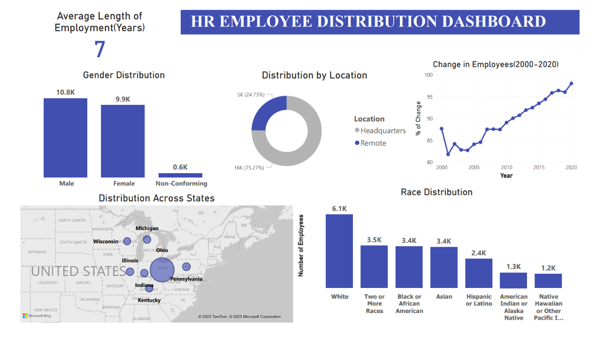

## Purpose: 

The purpose of this project is to perform data cleaning and analysis on HR data and creating a dashboard for visualization purpose.

## Tools Used :

- Data Cleaning & Analysis - MYSQL
- Data Visualization - Microsoft Power BI

## Data:

-  HR Data with over 22000 rows from the year 2000 to 2020.

## HR Dashboard

## Data Cleaning & Analysis :

***1. Rename the ID column***

***Result:***

***2. Convert the birthdate column to Date from Text and format the date to %Y-%m-%d.***

***Result:***

***3. Modify birthdate column datatype to DATE from Text***

