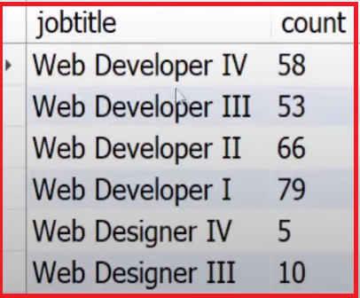

## Purpose: 

The purpose of this project is to perform data cleaning and analysis on HR data and creating a dashboard for visualization purpose.

## Tools Used :

- Data Cleaning & Analysis - MYSQL
- Data Visualization - Microsoft Power BI

## Data:

-  HR Data with over 22000 rows from the year 2000 to 2020.

## HR Dashboard

## DATA CLEANING

***1. Rename the ID column***

***Result:***

***2. Convert the birthdate column to Date from Text and format the date to %Y-%m-%d.***

***Result:***

***3. Modify birthdate column datatype to DATE from Text***

***4. Convert the hire_date column to Date from Text and format the date to %Y-%m-%d***

***Result:***

***5. Convert the termdate column to Date from Text and format the date to %Y-%m-%d***

***Result:***

***6. Add an Age column to the table and populate the values based on birthdate***

***Result:***

## DATA ANALYSIS

***1. What is the gender breakdown of employees in the company?***

***2.What is the race/ethnicity breakdown of employees in the company?

***3. What is the age distribution of employees in the company?***

***4. How many employees work at headquarters vs remote locations?

***5. What is the average length of employment for employees who have been terminated?

***6. How does the gender distribution vary across departments and job titles?

***7. What is the distribution of job titles across company?

***8. Which department has the highest attrition rate?

***9. What is the distribution of employees across locations by state?

***10. How has the employee count changed over time based on hire and term date?***

***11. What is the tenure distribution for each department?

